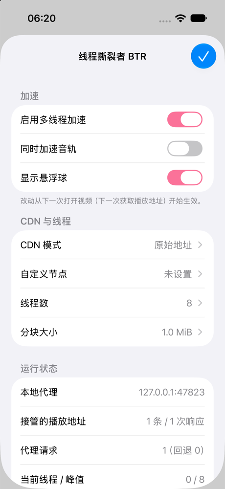

# BTR-iOS

这是哔哩哔哩官方 iOS App 的 **LiveContainer tweak**，把
[Bilibili 线程撕裂者（BTR）](https://github.com/MrTangLuyao/Bilibili-thread-ripper) 的思路带到 iPhone 和 iPad 上：
它把视频切成小块，多条连接、多个 CDN 节点同时下载，再按顺序交给 App 自带的播放器。
主要解决海外看冷门视频、4K 和高码率视频时的卡顿。

> **非官方、实验性质。** 本项目不绕过会员、登录、地区、清晰度、审核状态、DRM 或媒体签名限制，
> 只加速你本来就有权播放的媒体字节，也不上传任何数据。**目前没有在真机上和真实哔哩哔哩 App 里验证过**，
> 详见下文“验证状态”。



## 工作原理

```text
哔哩哔哩 App ──(gRPC PlayViewUnite / PlayView、JSON playurl)──> B 站接口
      │                       ▲
      │      NSURLSession 钩子：把响应里视频流的主地址改成 http://127.0.0.1:47823/btr/…，
      │      备用地址（backup_url）保持原样
      ▼
App 自带播放器 ──Range 请求──> BTR 本地代理（进程内，只监听 127.0.0.1）
                                 │  把请求的区间切成小块（首块 256 KiB，之后按设置的分块大小）
                                 ├─ 节点 A ─┐
                                 ├─ 节点 B ─┼─ 校验每一块的 Content-Range 和长度，按顺序写回播放器
                                 └─ 节点 C ─┘
```

- **改写播放地址**：接管 `NSURLSession` 的 completion handler 任务，以及 AFNetworking 这类
  delegate 任务（代理类在会话创建时被接管，响应先缓存，改写后一次性交给原代理）。
  路径里包含 `playurl` 或 `PlayView` 的响应会被检查，支持：
  - gRPC 帧（含 gzip 压缩帧，改写后重新 gzip）；
  - 不依赖 `.proto` 定义的通用 protobuf 改写：递归解析消息，改写后重建所有外层长度前缀，
    没改动的字段逐字节保留。同一消息里**字段号最小**的媒体 URL 是主地址（`DashVideo.base_url=1`、
    `DashItem.base_url=2`、`ResponseUrl.url=4`），其余都是备用地址；
  - JSON（`base_url`、`baseUrl`、`url`）。
- **本地代理**：移植 BTR 的 CDN 规则：大陆 / 海外节点表、用非 akamai 地址做模板换节点、
  只有 akamai 地址时用它做模板、两次 0 字节失败停用节点（4xx 只怪地址不怪节点）、失败后冷却退避、
  测速有效期 90 秒。调度方式：没测过的节点各先分一块试速度，之后按“谁最快能再交一块”分配；
  快要交给播放器的那块迟到时，向另一个节点再发一份（hedge），先到的为准；首块同时向两个节点竞速。
  B 站下发的原始地址也会排在最后参与下载。
- **安全回退**：首块在所有节点都失败时，代理返回 HTTP 502，播放器会改用 B 站给的备用地址，不会卡死；
  CDN 返回 200 整文件或错位的区间时，那一块直接丢弃，不会交给播放器。
- **默认只加速视频轨**。音轨很小，加速收益低；需要时可以在面板里打开。直播流（`live-bvc`）不处理。

## 安装到 LiveContainer

1. 准备一份**已解密**的哔哩哔哩 IPA（App Store 下载的 IPA 是加密的，LiveContainer 跑不了），
   在 LiveContainer 里安装。国内版、HD 版、国际版（`com.bstar.intl`）都会启用；
   bundle ID 不含 `bili`、`danmaku`、`bstar` 的 App 里，BTR 什么也不做。
2. 从 [Releases](../../releases/latest) 下载最新的 `BTR-iOS.dylib`（main 分支每次构建和测试通过后自动发布，
   标签为 `build-<编号>`，说明里附有对应提交和 SHA-256）。也可以从 [Actions](../../actions) 下载
   `BTR-iOS-dylib` 构件，或者在本机执行 `./build.sh`，得到 `build/BTR-iOS.dylib`。
3. LiveContainer → **Tweaks** 标签 → `+` → **New Folder**，比如命名为 `BTR`；进入文件夹 → `+` →
   **Import Tweak**，选 `BTR-iOS.dylib`。
4. 长按哔哩哔哩 → **Settings** → **Tweak Folder** 选 `BTR`。共享（shared）App 要先转成私有（private）
   才能改这一项，改完可以再转回去。
5. 启动 App。LiveContainer 会自动用自己的证书给 tweak 签名；签名失败可以在 Tweaks 标签点 **Sign**。
   不要打开 “Don't Inject TweakLoader”。
6. 屏幕右侧出现粉色 **BTR** 悬浮球就说明装好了。点它打开设置；悬浮球被隐藏时，**三指长按**屏幕
   0.8 秒也能打开设置。有内容盖在上面时（例如全屏播放器、弹出页），悬浮球会自动隐藏。

## 设置

| 设置 | 默认 | 说明 |
| --- | --- | --- |
| 启用多线程加速 | 开 | 关掉后不再改写播放地址，从下一个视频开始生效 |
| 同时加速音轨 | 关 | |
| CDN 模式 | 大陆 CDN | 也可以选海外 CDN；“原始地址”只用 B 站给的地址做多线程；“自定义”只用你填的节点 |
| 自定义节点 | 空 | 只接受 B 站视频服务器（bilivideo.com、akamaized.net 等），最多 32 个，为空时按大陆 CDN |
| 线程数 | 8 | 一个请求同时下载的块数上限，可选 4 / 8 / 16 / 32 / 64 |
| 分块大小 | 1 MiB | 可选 256 KiB 到 4 MiB；为了控制内存，预取窗口最多 48 MiB |

面板里能看到接管了多少播放地址、代理请求数、回退次数、当前和峰值线程、已下载和已交付的字节数，
以及每个 CDN 节点的状态和速度。**日志**页可以分享完整日志，反馈问题时请附上
（日志不含 Cookie；为了排障会记录节点主机名，分享前请自行检查）。

## 构建与测试

只需要 Xcode 命令行工具，不需要 Theos：

```bash
./build.sh          # 生成 build/BTR-iOS.dylib（arm64，iOS 14+，ad-hoc 签名）
./tests/run.sh      # macOS 上的主机测试：CDN 规则、JSON / protobuf / gRPC 改写、NSURLSession 钩子、本地代理
./tests/sim/run.sh  # iOS 模拟器冒烟测试：模仿 TweakLoader 用 dlopen 加载，走一遍完整链路并截图
```

主机测试会在本机起三个回环测试服务器（快、慢、全部 403），检查的内容包括：开放区间、中间区间、
越界裁剪、单字节、无 Range 返回 200、HEAD、416、全部节点拒绝时返回 502、播放器断开后下载全部停止、
并发请求的数据正确。GitHub Actions 每次推送都会跑主机测试，并把 dylib 作为 artifact 上传。

## 验证状态

| 项目 | 状态 |
| --- | --- |
| arm64 iOS dylib 编译（Xcode clang，`-Wall -Wextra` 无警告） | ✅ 本机通过 |
| 改写器、钩子、代理的主机测试 | ✅ 本机通过 |
| iOS 模拟器：dlopen 加载、钩子安装、delegate 会话的 playurl 改写、经代理取回 7 MiB 完整数据、悬浮球和设置面板 | ✅ 本机通过（iOS 27 模拟器） |
| LiveContainer 真机加载 | ⚠️ 未验证 |
| 真实哔哩哔哩 App 的接口确实经过被接管的 NSURLSession 方法 | ⚠️ 未验证（社区探针显示它用 NSURLSession 和静态链接的 AFNetworking，见致谢） |
| 播放器接受 `http://127.0.0.1` 地址并通过代理播放 | ⚠️ 未验证 |
| 真实 B 站 CDN 上的提速效果 | ⚠️ 未验证 |

## 已知限制和风险

- **App 更新可能让它失效**：接口路径、protobuf 结构、网络库，或者播放器对地址的校验一变，就可能失效。
  失效时一般表现为“没有接管”（面板里“接管的播放地址”一直是 0），不会改坏响应。
  遇到这种情况请导出日志。
- **App 可能不走被接管的路径**：如果某个版本的哔哩哔哩用自研网络栈（例如 Cronet 或自己的 socket）
  请求播放地址，钩子就看不到这些响应。如果播放器自己有地址白名单，或者用 HTTPDNS 替换主机名，
  也可能拒绝回环地址。这些都需要真机日志确认。
- **ATS**：回环地址是 `http://`。LiveContainer 自己的 Info.plist 允许任意加载和本地网络，
  但最终哪份 Info.plist 生效取决于 LiveContainer 的实现，没有验证过。
- **风控**：BTR 的做法是把同一个带签名的地址拿到其他官方节点上做多连接 Range 下载，
  请求量会比原生播放器多，存在被 B 站限速或风控的可能。实测时一个伪造签名的请求在真实大陆节点上
  返回过 `HTTP 959`，这类拒绝会正常计入失败并触发回退。
- **后台**：iOS 挂起 App 时可能回收监听 socket。代理会在同一个端口（默认 47823，被占用时随机）重新监听；
  如果端口在重启后变化，旧的播放地址会失效，App 会重新获取。
- **离线缓存**：哔哩哔哩的离线下载如果也用了改写后的地址，就会经过本地代理，只在 App 运行期间有效。
- 不支持直播加速，也不支持 BTR 网页版的“全接管”播放器。

## 致谢与许可证

- 核心思路、CDN 节点表、候选地址和节点停用规则来自
  [MrTangLuyao/Bilibili-thread-ripper](https://github.com/MrTangLuyao/Bilibili-thread-ripper)
  （MIT，© 2026 Bilibili-thread-ripper contributors）以及
  [Bilibili-thread-ripper-desktop](https://github.com/MrTangLuyao/Bilibili-thread-ripper-desktop)（MIT，© 2026 LouieTang）。
  感谢原作者。
- 关于官方 App 网络栈的社区公开研究：MinamiHashiRun0 的
  [BiliRawPackFast](https://github.com/MinamiHashiRun0/BiliRawPackFast) 和
  [BiliAccelerator](https://github.com/MinamiHashiRun0/BiliAccelerator)。本项目没有复制它们的代码。
- [LiveContainer](https://github.com/LiveContainer/LiveContainer) 的 TweakLoader 负责加载本 tweak。

本项目采用 MIT 协议，见 [LICENSE](LICENSE)，其中保留了原项目的版权声明。
